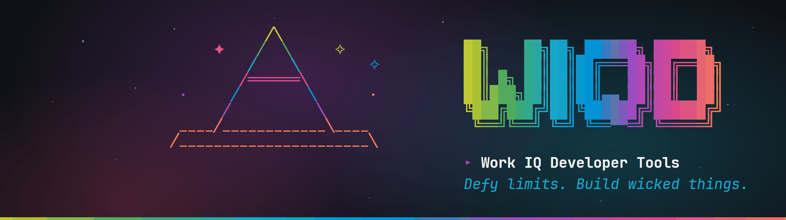

# Work IQ Dev Tools - The agentic experience for Microsoft 365 Copilot extensibility

[](https://www.npmjs.com/package/@microsoft/wiqd)

<p align="center">
  
</p>

<p align="center">
  <strong>⚠️ Pre-release preview.</strong> Work IQ Dev Tools are experimental software shared for experimentation purposes only. They are not production-ready and are not officially supported. Expect breaking changes.
</p>

Work IQ Dev Tools are the agentic experience for Microsoft 365 Copilot extensibility that takes any plugin (skills, connectors, declarative agents) from an empty folder to a published, monitored product. One install. One mental model. The whole lifecycle in a single flow that you, or the Copilot building alongside you, can run end to end.

> This repository hosts Work IQ Dev Tools' documentation, downloads, and project meta-files. The `wiqd` CLI itself is publicly available via npm — see the [Quick start](#quick-start) below to install it — while its source remains private to Microsoft during this preview.

## What you can do with Work IQ Dev Tools

- **Scaffold and edit agents** — start from a template, then add capabilities, API actions, instructions, and translations through guided workflows.
- **Validate before you ship** — catch manifest and reference errors in your editor or from the terminal, with both static and deep validation modes.
- **Fix and improve agents with guided help** — ask Copilot to diagnose what's wrong and walk you through repairs, instead of grepping through schemas.
- **Package and provision** — produce a distributable app package and deploy it to a Microsoft 365 environment with a single command.
- **Share with your team or tenant** — distribute agents to specific users or across your Microsoft 365 tenant.
- **Evaluate and monitor** — run quality evals against deployed agents and inspect usage telemetry once they're live.

## The primary experience: plugin, workflows, and guided journeys

Work IQ Dev Tools' main surface for developers is a **Copilot plugin** that loads twenty purpose-built **workflows** into GitHub Copilot CLI and the VS Code Copilot Chat experience. Each workflow encapsulates deep knowledge about a specific stage of the agent lifecycle — it enforces prerequisites, suggests the right next step, and refuses to proceed when something is off.

You talk to the experience in natural language:

```text
"create a new declarative agent with web search"
"validate my agent and help me fix the errors"
"package and share my agent with my team"
```

A few of the workflows available within the plugin:

- **`agent-journey`** — the orientation workflow that meets you wherever you are and points you to the right next workflow.
- **`agent-create`**, **`agent-edit`**, **`agent-validate`**, **`agent-package`**, **`agent-provision`**, **`agent-share`** — drive each stage in a guided way.
- **The fix-and-improve loop** — `agent-edit` updates the manifest, `agent-validate` explains and helps repair issues, `agent-provision` deploys your changes, and `agent-debug` lets you try the result interactively. Copilot walks you through the cycle in plain language instead of leaving you alone with raw errors.
- **`agent-eval`** and **`agent-monitor`** — keep an agent healthy once it's live.

Browse the full command surface in the [CLI Reference](https://aka.ms/wiqd/docs?id=cli/reference).

## Key highlights

| Highlight                    | What it gives you                                                                              |
| ---------------------------- | ---------------------------------------------------------------------------------------------- |
| **Full agent lifecycle**     | Create, validate, package, provision, publish, share, and monitor agents end-to-end.           |
| **Guided Copilot workflows** | Twenty workflows cover scaffolding, authoring, validation, debugging, sharing, and evaluation. |
| **Editor-grade validation**  | Built-in Language Server Protocol support gives real-time manifest validation in VS Code.      |
| **Extensible**               | Add commands, validation providers, and health checks via npm-based extensions.                |
| **Automation-ready**         | Every guided workflow has an equivalent CLI command for scripts and CI.                        |
| **Quality evaluation**       | Run YAML-defined eval suites against your agents and enforce pass/fail thresholds.             |

## The CLI

The `wiqd` CLI powers all of the above. It also doubles as an automation surface — every guided workflow has an equivalent command you can call directly from scripts or CI.

A pocket-sized command set:

```powershell
wiqd auth login            # sign in to Microsoft 365
wiqd agent create          # scaffold a new agent
wiqd agent validate        # check the manifest
wiqd agent provision       # deploy to your dev environment
wiqd agent share           # share with users or your tenant
wiqd doctor                # diagnose your environment
```

The full command tree — every option, exit code, and JSON output schema — lives in the [CLI Reference](https://aka.ms/wiqd/docs?id=cli/reference).

## Quick start

```powershell
# Windows
iex "& { $(irm 'https://aka.ms/wiqd/install.ps1') }"
```

```bash
# macOS / Linux
curl -fsSL https://aka.ms/wiqd/install.sh | bash
```

This installs the `wiqd` CLI from npm (with the supporting Microsoft 365 Agents Toolkit pulled in as a dependency), the Work IQ VS Code extension, and the Copilot CLI plugin. Node.js is a prerequisite: if a supported version isn't already on your machine the installer stops and points you to the download — it does **not** install Node for you. Then create your first agent:

```powershell
wiqd auth login
wiqd agent create --name my-first-agent
cd my-first-agent
wiqd agent validate
wiqd agent provision
wiqd agent share --scope users --email teammate@contoso.com
```

Or drive the whole lifecycle conversationally with Copilot CLI (interactive mode). The `--agent wiqd:wiqd` flag routes your request to the Work IQ Dev Tools orchestrator, which handles workflow routing, lifecycle orchestration, and next-step suggestions:

```bash
copilot -i "create a new declarative agent" --agent wiqd:wiqd
copilot -i "validate my agent" --agent wiqd:wiqd
copilot -i "deploy my agent locally" --agent wiqd:wiqd
```

Follow the [Quickstart](https://aka.ms/wiqd/docs?id=getting-started/quickstart/) for the step-by-step walkthrough, or see [Installation](https://aka.ms/wiqd/docs?id=getting-started/installation/) for options and troubleshooting.

## Common workflows

### Create and configure an agent

```powershell
wiqd agent create --name my-agent
cd my-agent
wiqd agent add action --openapi-spec ./api/openapi.yaml
```

To add a knowledge-source capability (web search, SharePoint, Graph connector), ask Copilot in natural language and let the `agent-edit` workflow update your manifest:

```text
"add web search to my agent"
```

See [agent-create](https://aka.ms/wiqd/docs?id=cli/reference#wiqd-agent-create) and [agent-edit](https://aka.ms/wiqd/docs?id=cli/reference).

### Validate, fix, and package

```powershell
wiqd agent validate       # static + deep validation
wiqd agent package        # build a distributable zip
```

See [agent-validate](https://aka.ms/wiqd/docs?id=cli/reference#wiqd-agent-validate) and [agent-package](https://aka.ms/wiqd/docs?id=cli/reference#wiqd-agent-package).

### Share with users or your tenant

```powershell
wiqd agent share --scope users --email teammate@contoso.com
wiqd agent share --scope tenant
```

See [agent-share](https://aka.ms/wiqd/docs?id=cli/reference#wiqd-agent-share).

### Evaluate and monitor

```powershell
wiqd agent eval                           # run quality evals
wiqd agent monitor                        # inspect usage telemetry
```

See [agent-eval](https://aka.ms/wiqd/docs?id=cli/reference#wiqd-agent-eval) and [agent-monitor](https://aka.ms/wiqd/docs?id=cli/reference#wiqd-agent-monitor).

## Where to go next

- [Getting Started](https://aka.ms/wiqd/docs?id=getting-started/) — installation, authentication, and your first agent in five minutes.
- [CLI Reference](https://aka.ms/wiqd/docs?id=cli/reference) — every command, option, and exit code.
- [Copilot workflows](https://aka.ms/wiqd/docs?id=cli/reference) — the guided workflows available through the plugin, mapped to their CLI commands.
- [Installation & troubleshooting](https://aka.ms/wiqd/docs?id=getting-started/installation/) — install options, custom flags, and common fixes.

## Contributing

The wiqd CLI is publicly available; its source is private to Microsoft during this preview. See [Contributing](CONTRIBUTING.md) for how to report issues, request features, and reach the team — the short version: run `wiqd feedback submit` from the CLI.

## Telemetry

wiqd collects anonymous usage telemetry — [OpenTelemetry](https://opentelemetry.io/) spans for the commands you run — to help improve the product. Telemetry is **on by default** with a one-time first-run disclosure, flows through a single disclosed channel, and has a single, unified opt-out. When telemetry is disabled, the pipeline is never constructed and **no telemetry network calls are made** (including the background version-check ping).

To turn it off, use any one of the following:

```powershell
# Persisted config — applies to all future runs
wiqd config set telemetry=false

# Environment variable (canonical) — PowerShell
$env:WIQD_TELEMETRY = "0"

# Environment variable (canonical) — bash / zsh
export WIQD_TELEMETRY=0

# Or the standard DO_NOT_TRACK convention
export DO_NOT_TRACK=1
```

Accepted opt-out values for `WIQD_TELEMETRY` are `0`, `false`, `no`, or `off` (case-insensitive). The legacy alias `WIQD_TELEMETRY_DISABLED=true` also works. See the [Telemetry documentation](https://aka.ms/wiqd/docs?id=project/telemetry/) for exactly what is collected and the full opt-out precedence rules.

## Trademarks

This project may contain trademarks or logos for projects, products, or services. Authorized use of Microsoft trademarks or logos is subject to and must follow [Microsoft's Trademark & Brand Guidelines](https://www.microsoft.com/en-us/legal/intellectualproperty/trademarks/usage/general). Use of Microsoft trademarks or logos in modified versions of this project must not cause confusion or imply Microsoft sponsorship. Any use of third-party trademarks or logos are subject to those third-party's policies.

## License

wiqd is licensed under the [MIT License](LICENSE). See the `LICENSE` and `NOTICE` files distributed with wiqd for the full license text and third-party attributions.

Copyright (c) Microsoft Corporation. All rights reserved.
